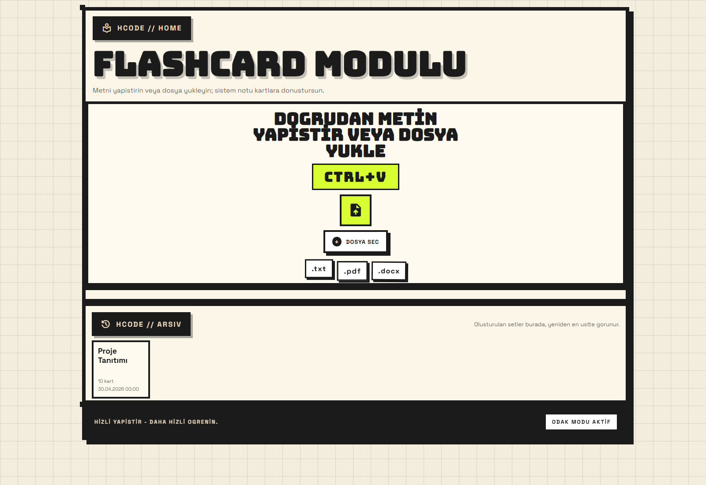
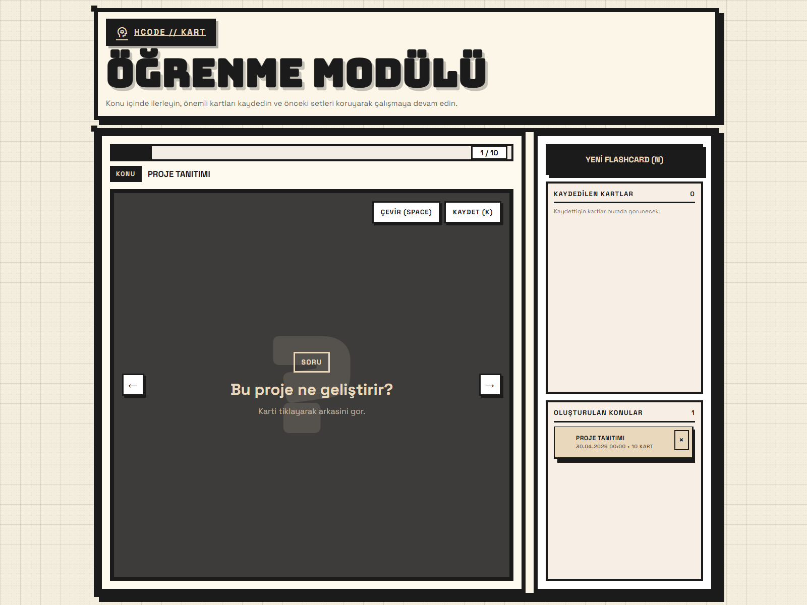

# AI-Powered Flashcard App

Girdiğiniz herhangi bir not, yazı veya belgeden otomatik olarak yapay zeka destekli flashcard ve soru-cevap çiftleri üreten Flask tabanlı bir web uygulamasıdır.

## 🚀 Özellikler
- **Metin & Dosya Girişi:** İstediğiniz herhangi bir notu/yazıyı girin veya UTF-8 formatlı dosyaları yükleyin.
- **Otomatik Soru/Kart Üretimi:** Yapay zeka ile otomatik flashcard ve soru-cevap çiftleri oluşturun.
- **Düzenleme & Kaydetme:** Üretilen kartları düzenleyin ve SQLite veritabanında saklayın.

## 📸 Ekran Görüntüleri
| Ana Sayfa | Proje Tanıtımı |
| --- | --- |
|  |  |

## 🛠️ Kurulum ve Çalıştırma

1. **Depoyu Klonlayın ve Klasöre Geçin:**
   ```bash
   git clone https://github.com/h-kod/flashcard-app.git
   cd flashcard-app
   ```

2. **Sanal Ortamı Hazırlayın ve Paketleri Yükleyin:**
   ```bash
   python -m venv .venv
   .venv\Scripts\activate  # Windows
   # source .venv/bin/activate  # macOS/Linux
   pip install -r requirements.txt
   ```

3. **Uygulamayı Çalıştırın:**
   ```bash
   python run.py
   ```
   Tarayıcınızda `http://localhost:5000` adresinden uygulamaya erişebilirsiniz.

## 🧪 Testleri Çalıştırma
```bash
python -m pytest
```

## 📁 Proje Yapısı

```
flashcard-app/
├── app/                 # Flask backend (rotalar, modeller, NLP ve API istemcisi)
├── data/                # SQLite veritabanı ve veri saklama alanı
├── static/              # İstemci tarafı varlıkları (CSS, JS, resimler)
├── templates/           # HTML (Jinja2) arayüz şablonları
├── tests/               # Birim testleri (pytest)
├── uml/                 # UML tasarım diyagramları ve otomatik diyagram üreten betik
├── requirements.txt     # Python kütüphane bağımlılıkları
├── run.py               # Uygulamayı yerelde çalıştıran dosya
├── wsgi.py              # Sunucu dağıtım (WSGI) giriş noktası
└── render.yaml          # Render.com bulut dağıtım yapılandırması
```

## 📄 Lisans
Bu proje [MIT Lisansı](LICENSE) altında lisanslanmıştır.
